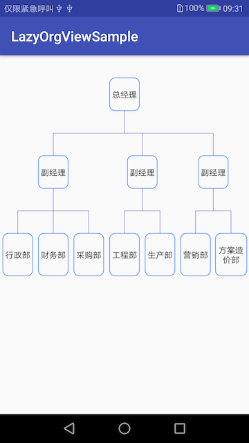
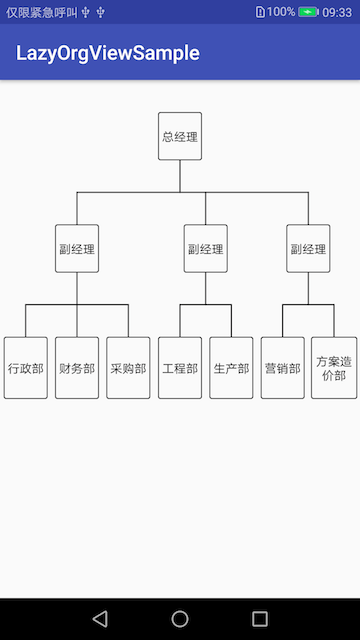

# LazyOrgView
A Simple Realization or OrgView Because I cannot find a valid solution unless Google OrgChart and some OrgChart.js.

## Installation
### Gradle
**Step 1.** Add it in your root build.gradle at the end of repositories:
```groovy
allprojects {
    repositories {
	      ...
	      maven { url 'https://jitpack.io' }
    }
}
``` 
**Step 2.** Add the dependency
```groovy

dependencies {
    implementation 'com.github.onlyloveyd:LazyOrgView:v1.0'
}
```

## Basic Usage
**Step 1.** Add **LazyOrgView** into your layout.
```xml
<?xml version="1.0" encoding="utf-8"?>
<FrameLayout xmlns:android="http://schemas.android.com/apk/res/android"
    xmlns:tools="http://schemas.android.com/tools"
    android:layout_width="match_parent"
    android:layout_height="match_parent"
    tools:context=".MainActivity">

    <cn.onlyloveyd.lazyorgview.widget.LazyOrgView
        android:id="@+id/rv_content"
        android:layout_width="match_parent"
        android:layout_height="match_parent"/>

</FrameLayout>
```
**Step 2.** Construct root TreeNode and other node, finally organize tree relationship by
addChildNode method.
```java
    TreeNode root = new TreeNode("总经理");
    root.isRoot = true;

    TreeNode A = new TreeNode("副经理");
    TreeNode Aa = new TreeNode("行政部");
    TreeNode Ab = new TreeNode("财务部");
    TreeNode Ac = new TreeNode("采购部");

    TreeNode B = new TreeNode("副经理");
    TreeNode Ba = new TreeNode("工程部");
    TreeNode Bb = new TreeNode("生产部");
    
    TreeNode C = new TreeNode("副经理");
    TreeNode Ca = new TreeNode("营销部");
    TreeNode Cb = new TreeNode("方案造价部");
    TreeNode Cc = new TreeNode("售后服务部");
    
    root.addChildNode(A);
    root.addChildNode(B);
    root.addChildNode(C);
    
    A.addChildNode(Aa);
    A.addChildNode(Ab);
    A.addChildNode(Ac);
    
    B.addChildNode(Ba);
    B.addChildNode(Bb);
    
    C.addChildNode(Ca);
    C.addChildNode(Cb);
```
**Step 3.** Add LazyOrgConfig and Add rootNode to LazyOrgView. 
```java
	  lazyOrgView.setRootNode(root);
	  LazyOrgConfig lazyOrgConfig = new LazyOrgConfig();
	  lazyOrgConfig.setLineColor(Color.BLUE).setTextSize(12)
	               .setLineWidth(1)
	               .setTextBgColor(Color.GREEN)
	               .setTextBgRes(R.drawable.rect_shape);
	  lazyOrgView.setLazyOrgConfig(lazyOrgConfig);
```
## Basic Result



